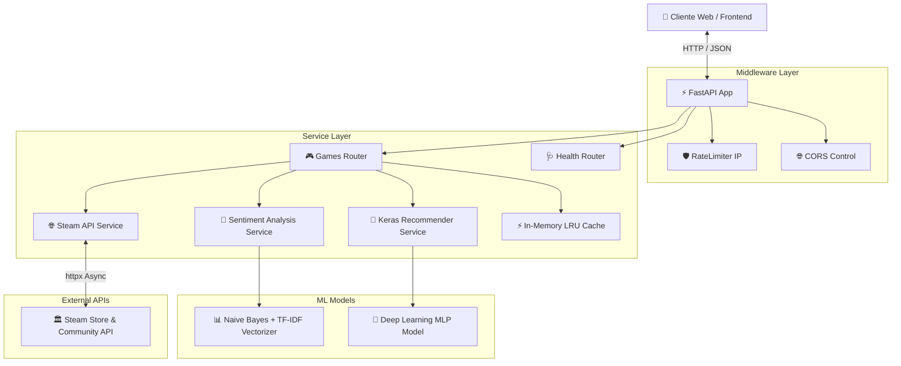

# 🎮 Game Recommended AI — Backend API 🧠

[](https://game-recommended.alejandrotg.es)
[](https://www.python.org/)
[](https://fastapi.tiangolo.com/)
[](https://keras.io/)
[](https://docs.pytest.org/)

API REST de alto rendimiento desarrollada con **FastAPI** que impulsa la plataforma **Game Recommended AI**. Integra procesamiento de lenguaje natural (NLP) y modelos de Machine Learning/Deep Learning para auditar las reseñas en español de videojuegos en Steam y recomendar títulos mediante búsqueda semántica por descripción.

🚀 **[Prueba la Aplicación en Producción](https://game-recommended.alejandrotg.es)**

---

## 📐 Arquitectura del Sistema



---

## ✨ Características Principales

* 🔍 **Integración Directa con Steam API**: Búsqueda asíncrona de videojuegos en tiempo real mediante cliente `httpx` de alto rendimiento.
* 🧠 **Análisis de Sentimiento IA (Naive Bayes + TF-IDF)**: Extracción y vectorización de opiniones escritas en español para clasificar cada reseña en *Positiva* o *Negativa*.
* 🎯 **Recomendador de Juegos por Descripción (Keras MLP)**: Red neuronal multicapa (MLP) entrenada en Keras para predecir etiquetas de género basadas en descripciones en lenguaje natural y sugerir el TOP 10 de juegos coincidentes.
* 🛡️ **Protección y Rate Limiting**: Middleware per-IP configurable que previene ataques de fuerza bruta y abusos de API (`RateLimitMiddleware`).
* 🏷️ **Generador de Badges SVG Dinámicos**: Endpoint que genera insignias SVG al vuelo con el veredicto del modelo para incrustar en archivos `README.md` de GitHub.
* ⚡ **Caché en Memoria (LRU)**: Sistema de caché con tiempo de vida (TTL) automatizado para acelerar las peticiones recurrentes y reducir el consumo de la API de Steam.
* 🧪 **Suite de Pruebas Automatizadas**: Cobertura robusta de tests unitarios y de integración con `pytest` y `httpx.AsyncClient`.

---

## 🌐 Referencia de la API REST

| Método | Endpoint | Descripción | Parámetros |
| :--- | :--- | :--- | :--- |
| `GET` | `/` | Estado base de la API y modelo cargado | Ninguno |
| `GET` | `/health` | Chequeo de salud del servicio y memoria | Ninguno |
| `GET` | `/api/search` | Busca juegos por nombre en Steam | `term` (string, requerido) |
| `GET` | `/api/analyze/{app_id}` | Analiza las reseñas y calcula el veredicto IA | `app_id` (int), `limit` (int, default: 30) |
| `GET` | `/api/games/{app_id}/badge` | Genera badge SVG dinámico del veredicto | `app_id` (int) |
| `GET` | `/api/recommend` | Recomienda juegos según la descripción introducida | `description` (string, requerido) |

Documentación interactiva disponible localmente en Swagger UI: `http://localhost:8000/docs`

---

## 🧠 Modelos de Machine Learning Integrados

1. **Modelo de Análisis de Sentimiento**:
   * **Algoritmo**: Naive Bayes Multinomial + Vectorizador TF-IDF.
   * **Propósito**: Preprocesamiento de texto en español (normalización, eliminación de stopwords y caracteres especiales) e inferencia en lote del sentimiento de cada reseña.
   * **Veredictos**: *Extremadamente Recomendado (≥80%)*, *Recomendado (≥60%)*, *Mixto (≥40%)*, *No Recomendado (<40%)*.

2. **Modelo de Recomendación por Descripción**:
   * **Algoritmo**: Red Neuronal Secuencial Multicapa (MLP) entrenada con **Keras / TensorFlow**.
   * **Propósito**: Clasificación multietiqueta de géneros a partir del texto introducido por el usuario, cruzando las etiquetas predichas con el catálogo de Steam.

---

## 📁 Estructura del Proyecto

```text
backend/
├── app.py                  # Punto de entrada FastAPI, ciclo de vida (lifespan) y middlewares
├── middleware.py           # Rate Limiter por IP
├── requirements.txt        # Dependencias de Python (FastAPI, Scikit-learn, TensorFlow, httpx)
├── .env.development        # Variables de entorno para desarrollo
├── .env.production         # Variables de entorno para producción
├── model/                  # Pesos y artefactos de los modelos de ML (.joblib, .h5, .pkl)
├── routers/
│   ├── games.py            # Rutas de búsqueda, análisis, badge y recomendación
│   └── health.py           # Endpoint de salud e información del sistema
├── services/
│   ├── steam.py            # Cliente HTTP asíncrono y llamadas a la API de Steam
│   ├── sentiment.py        # Inferencia del modelo Naive Bayes
│   ├── recommendation.py   # Inferencia del modelo Keras de recomendaciones
│   └── cache.py            # Gestión del almacenamiento en caché LRU
└── tests/                  # Suite de pruebas con pytest
```

---

## 🛠️ Instalación y Configuración Local

### Requisitos Previos
* Python 3.10 o superior.
* Gestor de entornos virtuales (`Conda` o `venv`).

### Pasos de Ejecución

1. Clonar el repositorio y navegar a la carpeta del backend:
   ```bash
   cd backend
   ```

2. Crear y activar el entorno virtual:
   ```bash
   python -m venv venv
   # En Windows:
   .\venv\Scripts\activate
   # En Linux/macOS:
   source venv/bin/activate
   ```

3. Instalar dependencias:
   ```bash
   pip install -r requirements.txt
   ```

4. Iniciar el servidor de desarrollo con Uvicorn:
   ```bash
   uvicorn app:app --reload --port 8000
   ```

5. Acceder a la documentación interactiva OpenAPI en tu navegador:
   * **Swagger UI**: [http://localhost:8000/docs](http://localhost:8000/docs)
   * **ReDoc**: [http://localhost:8000/redoc](http://localhost:8000/redoc)

---

## 🧪 Ejecución de Pruebas Automatizadas

El backend incluye pruebas unitarias e integrales para garantizar la robustez del servicio:

```bash
# Ejecutar todas las pruebas con pytest
pytest -v

# Ejecutar pruebas con reporte de cobertura
pytest --cov=services --cov=routers
```

---

## 🔒 Variables de Entorno

Configuradas en `.env.development` y `.env.production`:

| Variable | Descripción | Valor por Defecto |
| :--- | :--- | :--- |
| `ENV` | Entorno de ejecución (`development` / `production`) | `development` |
| `CORS_ORIGINS` | Orígenes permitidos separados por comas | `http://localhost:5173` |
| `RATE_LIMIT` | Peticiones máximas por ventana | `30` |
| `RATE_WINDOW` | Ventana del rate limiter en segundos | `60` |

---

Desarrollado por [Alejandro Tacoronte González](https://alejandrotg.es).
